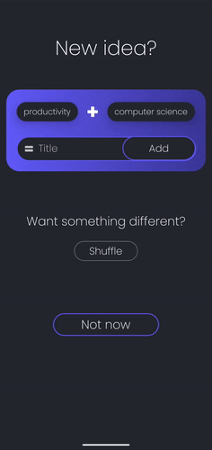
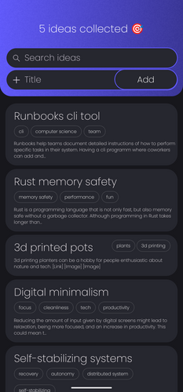
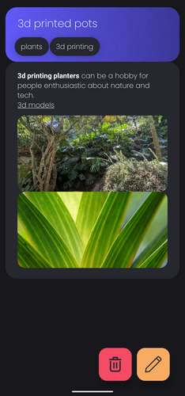
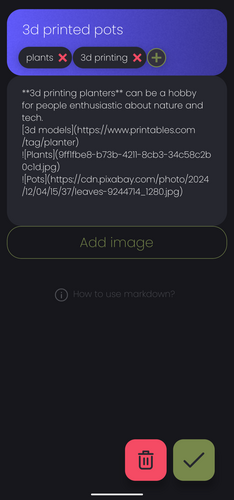
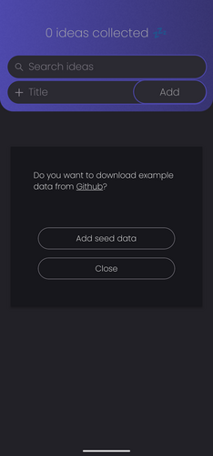

# idea-mixer
Keep track of ideas and come up with new ones by reusing existing ideas.  
This repository contains the source code for the Idea Mixer app. It is part of a project carried out at IU International University.  

</img>  
Created by [@David Peters](https://github.com/peters-david)

## About
This app helps collecting ideas. Each idea gets an entry and is related to different concepts.
When starting the app a random combination of two concepts is shown. You can add a new idea connecting the two concepts.  

### Take a look

    
Download the android release at [the release page](https://github.com/peters-david/idea-mixer/releases).

## Develop
Prerequisites:
- [Node](https://nodejs.org/)  
- [Yarn](https://yarnpkg.com/) (or npm, which is included in node)
- Run `yarn` to install dependencies.
---
How to build: Run `yarn build-android`  
How to lint: Run `yarn lint`  
How to test: Run `yarn test`  
How to start a development server: `yarn start` / `yarn lan` / `yarn tunnel` / `yarn android` / `yarn ios`